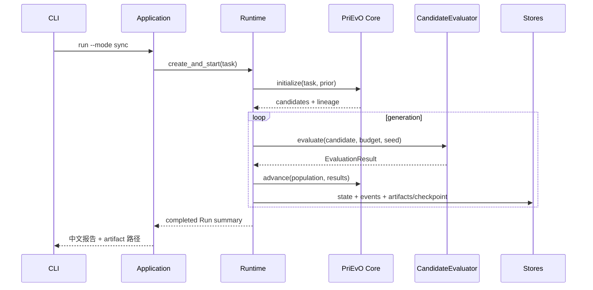
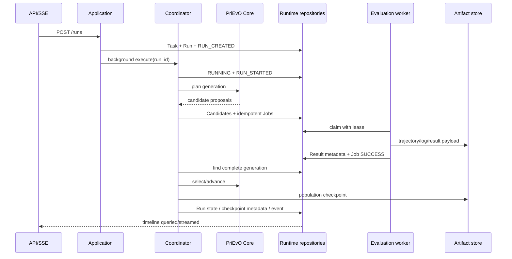

# 数据流

## research/CLI 同步路径

同步模式仍持久化相同对象，只是应用服务在一个调用中反复 `tick`，不能绕开 runtime/core 边界。

## persistent runtime 路径

## prior 数据流

`OptimizationTask dataset → deterministic sampling → landscape metrics → PriorRepository.numeric_top_k → optional LLM semantic refinement → matched instances → optimizer/operator empirical evidence → InstanceSpecificPrior artifact`。

LLM 精排失败、超时或 schema 无效时，使用数值排序的 top-N 并记录 `PRIOR_REFINEMENT_FALLBACK`。

## literature 数据流

`generation/reflection knowledge need → LiteratureSearchPort → LiteratureEvidence[] → citation-aware prompt context`。无索引或无结果时返回空证据，不阻塞核心 evolution；该流不读写 prior ranking。

## 实际一致性边界

- EvaluationJob enqueue 与预算预留：同一 SQLite 事务；唯一 idempotency key 防重。
- job claim：条件更新 `PENDING/RETRY_WAIT + available_at + lease`，失败表示未获得工作。
- 完成评价：先写 artifact（临时名→校验→原子发布），再在一个数据库事务提交 result/candidate/job/budget；随后追加 event。崩溃可能留下无事件的已提交状态或 orphan artifact，但不会双重结算。
- checkpoint：先发布 artifact，再写 checkpoint metadata，随后追加 event。恢复校验 artifact digest/schema/code version；这些步骤目前不是单一 UoW。
- Run lifecycle 的 current state 与 event 是相邻提交而非原子提交。V1 以 current state 为恢复事实源、event 为解释历史；多节点或严格审计场景需要 transactional outbox/UoW 后再提升承诺。
