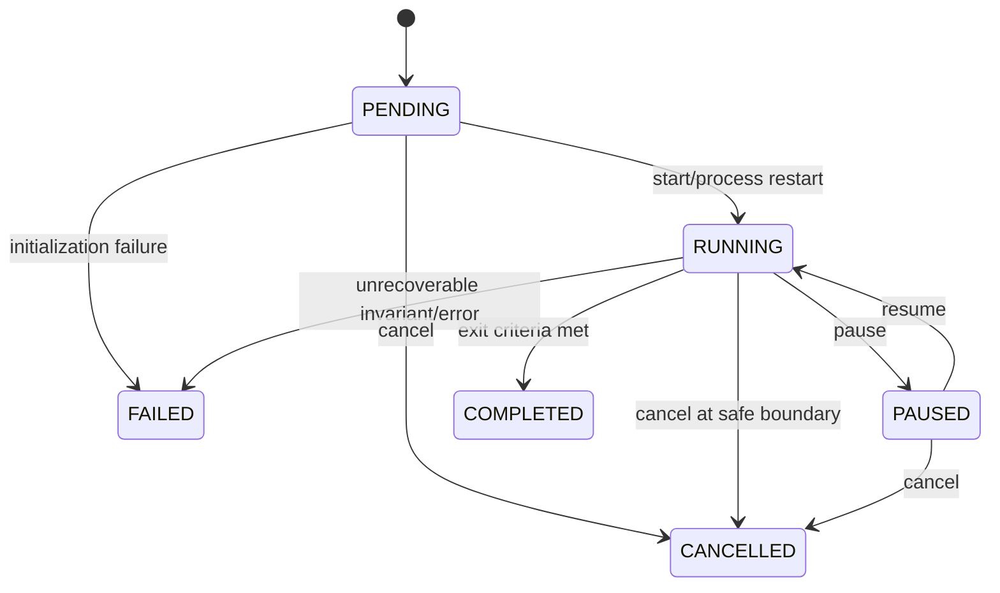
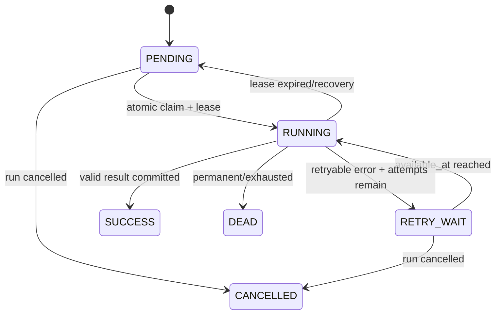

# 状态机与失败矩阵

## Run 状态机

终态：`COMPLETED/FAILED/CANCELLED`。V1 没有 `PAUSING/RECOVERING` 持久枚举或 optimistic version；checkpoint 恢复用事件表达 `RUN_RECOVERED`。取消在评价/代边界协作检查，竞态回归测试保证旧 `RUNNING` 对象不会覆盖已持久化的 `CANCELLED`。

## EvaluationJob 状态机

## 候选生命周期

`PROPOSED → EVALUATED → SELECTED/REJECTED`；无效代码为 `INVALID`。V1 没有单独持久化 `VALIDATED/QUEUED` 状态；Candidate 状态用于查询，不驱动 job 重试，EvaluationJob 是作业 source of truth。

## Failure matrix

| 失败 | 检测 | 确定性处理 | 事件/证据 |
|---|---|---|---|
| LLM 不可用/响应无效 | timeout/schema validation | retry 有界；fake/demo 或该 operator 失败，不改变预算 | `LLM_CALL_FAILED` + prompt/response metadata |
| prior LLM 精排失败 | timeout/schema | 回退数值 top-N | `PRIOR_REFINEMENT_FALLBACK` |
| candidate 静态校验失败 | AST/import/signature policy | 标记 `INVALID`，不创建执行 job | validation report artifact |
| evaluator timeout/crash | process exit/heartbeat | 终止子进程，retry 或 dead letter | attempt log artifact |
| worker 在 claim 后崩溃 | lease 过期 | recovery 将 job 重新置为可 claim | `JOB_LEASE_EXPIRED` |
| 重复提交 result | idempotency key/digest | 返回既有 success，不重复结算预算 | `DUPLICATE_RESULT_IGNORED` |
| artifact 写一半 | temp file/digest | 不发布 metadata，清理或隔离 orphan | artifact error log |
| DB 提交失败 | transaction exception | 回滚 current state/event/job；可重试 tick | structured error |
| checkpoint 损坏 | digest/schema/version | 明确拒绝恢复；V1 尚不自动回退上一 checkpoint | 失败原因 |
| 进程在代间中断 | 重新执行 RUNNING Run | 从最新 generation checkpoint 恢复并复用 logical results | `RUN_RECOVERED` |
| literature 无结果 | empty result | 继续 generation，不伪造证据 | `LITERATURE_EVIDENCE_EMPTY` |
| 预算不足 | reservation check | 不创建新 job，进入选择/完成或失败规则 | `BUDGET_EXHAUSTED` |

任何恢复动作不得由 LLM 决定。
