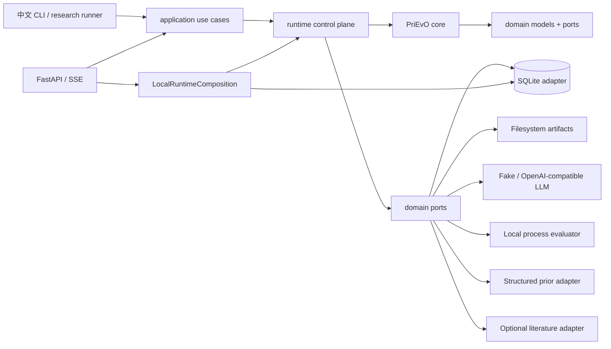

# PriEvO-Agent v1 目标架构

> 历史目标稿：用于追踪早期设计演进，不是 `1.0.0` 现行契约。当前实现见 [总体架构](../ARCHITECTURE.md)。

## 架构目标

同一套 PriEvO-derived core 同时服务两种入口：

- research/CLI runner：同步驱动小规模、可复现的研究或演示运行；
- persistent runtime：把运行、代、候选和评价拆成可恢复的长任务，通过数据库状态、作业 lease、checkpoint 和事件继续执行。

核心不依赖 FastAPI、SQLAlchemy、SSE、MCP、浏览器或具体 LLM SDK。

## 七个主要组件

| 组件 | 一句话职责 |
|---|---|
| API/CLI | 接收请求、202/SSE/中文输出，不含演化与 SQL 规则 |
| Application | Run 用例、prior/literature/tool governance 与查询 facade |
| PriEvO Core | operator schedule、prior seed、parent/population selection、lineage |
| Persistent Runtime | 状态机、durable evaluation job、预算、checkpoint、恢复与协作取消 |
| Domain Contracts | Run/Candidate/Job/Event/Prior/Evidence 模型、port 与错误 taxonomy |
| Infrastructure | SQLite/filesystem、Fake adapters、FLA/prior/BM25 与本地 composition root |
| Security/Observability | structured/AST/subprocess 边界，以及 Event/Log/Metric 派生视图 |



## 建议目录

```text
src/prievo_agent/
  api/                  # HTTP/SSE 入站适配器；只调用 application
  cli/                  # research/demo 命令；只调用 application
  application/          # create/start/pause/resume/cancel/query 等用例
  runtime/              # coordinator、job claim/lease、budget、checkpoint/recovery
  domain/               # dataclass/enum/event/port；无框架依赖
  core/                 # FLA、prior selection、evolution、population selection
  infrastructure/       # SQLite/filesystem、fake adapter、prior/BM25、composition root
  security/             # structured output、AST validation、受限 subprocess
tests/
docs/
```

与提示给出的概念层一致，仅新增 `cli/` 作为明确入站适配器，并将各外部实现按能力放入 `infrastructure/`。

## 依赖方向

`api/cli → application → runtime → core/domain`；API 的 composition root 选择 `infrastructure` adapter，`infrastructure → core/runtime/domain ports`。`core` 只允许依赖标准库、数值库和 `domain`，不得反向导入 runtime/application/infrastructure。自动测试禁止 domain/application 导入 infrastructure/API。

## v1 技术边界

采用 Python 3.11+、FastAPI/Pydantic、标准库 `sqlite3` 和 filesystem artifact store；没有 SQLAlchemy。API 使用单进程 `ThreadPoolExecutor` 提交本地 Runtime，评价工作经 SQLite durable job/lease 执行。数据库是生命周期和 job metadata 的 source of truth，大 payload 由 artifact store 保存。

## 明确不建设

| 技术 | v1 决策 | 理由/重新评估条件 |
|---|---|---|
| Redis | 不建设 | SQLite lease 足够本地单 worker；出现跨进程高频缓存/队列瓶颈再评估 |
| Neo4j | 不建设 | prior 关系规模可由 CSV/结构化记录表达；不把知识图谱名词等同于必须图数据库 |
| Chroma/FAISS/pgvector | 不建设 | literature v1 用 BM25；真实文档规模和 embedding 收益有证据后再加 |
| MCP | 不建设 | 先证明内部 Tool 的复用价值；外部 Agent 客户端需求出现再加薄 adapter |
| multi-agent registry | 不建设 | v1 的 generation/reflection 可用职责明确的 service/skill；无须为数量造 agent |
| WebSocket | 不建设 | 运行事件是单向通知，SSE 足够 |
| external broker | 不建设 | SQLite durable jobs + lease 支撑本地恢复；真实多节点吞吐需求出现再迁移 |
| MinIO | 不建设 | filesystem artifact store 足够本地 demo；多节点共享对象存储需求出现再加 |

## 非目标与可信声明

v1 不声称高可用、分布式、exactly-once 或 secure sandbox。目标是本地可运行、可恢复、可追踪、可测试；真实 LLM 和完整 benchmark 是可选适配器，deterministic fake 是 CI/demo 主链。
